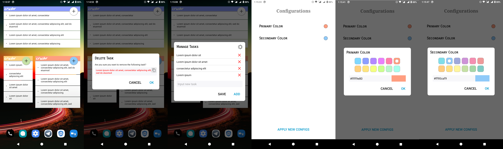

<div align='center'>
	
    <h1 style='color:#80d8ff;'>crushr</h1>
    <strong>A widget based TODO manager app for android</strong>
    <br>
	<p>
		
		
		<a href='https://github.com/iamrasel/crushr/blob/master/LICENSE.md'></a>
		<a href='https://github.com/iamrasel/crushr/actions'></a>
		<br>
		<a href='https://github.com/iamrasel/crushr/releases'></a>
		
		
	</p>
</div>

## Features
- [x] Supports from Android 4.2 (SDK 17 JB)
- [x] Add and delete task
- [x] Copy task text
- [x] Change primary and secondary color
- [x] Built-in material colors to select from
- [x] Custom color input
- [ ] See [TODO](#todo) section

## Screenshots


## Download
Currently, only one option is available for you to download this app, and it's Github release. This release version was built using Github's workflow, then I manually published the apk file as a release.

<div align='center'>
	<a href='https://github.com/iamrasel/crushr/releases/latest'></a>
</div>

You can also download the latest workflow build by Github. To do that, head over to the [Actions](https://github.com/iamrasel/crushr/actions) tab and then select the latest run from there. You must be signed in to Github to download any build from there.

There's another option to get this app- fork and build it. This project is very simple and pure, it doesn't need any additional setup. Just open it in Android Studio.

## TODO
- Known issues:
  - Tasks showing in random order
  - Bugs, those are playing with me
- Features:
  - Edit task
  - Show or hide the 'crushr' header
  - Widget's background color changing option
  - Task text's color changing option
  - Task text's size changing option
  - Task text's style changing option
  - Task text's font face changing option
  - Pin important tasks to notification
  
## Contributing
If you want to contribute to this project, I would suggest you to start from the [TODO](#todo) list first. Then you can do whatever comes up to your mind.

## Credits
As you can see, this is a fork of [this](https://github.com/tjmolinski/crushr) same titled project, which was abandoned back in 2015. I found this app on F-droid, used it and then decided to modify it to fulfill my needs. But then I thought, why not share it with others?

## License
```
	The MIT License (MIT)
	...
	And you know the rest.
```
