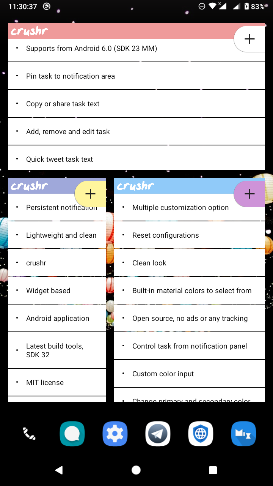
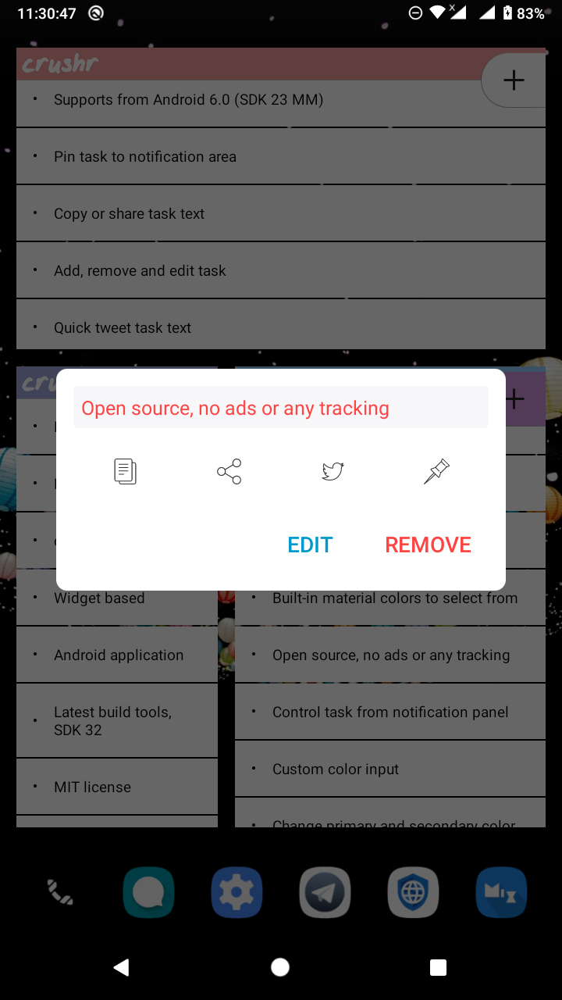
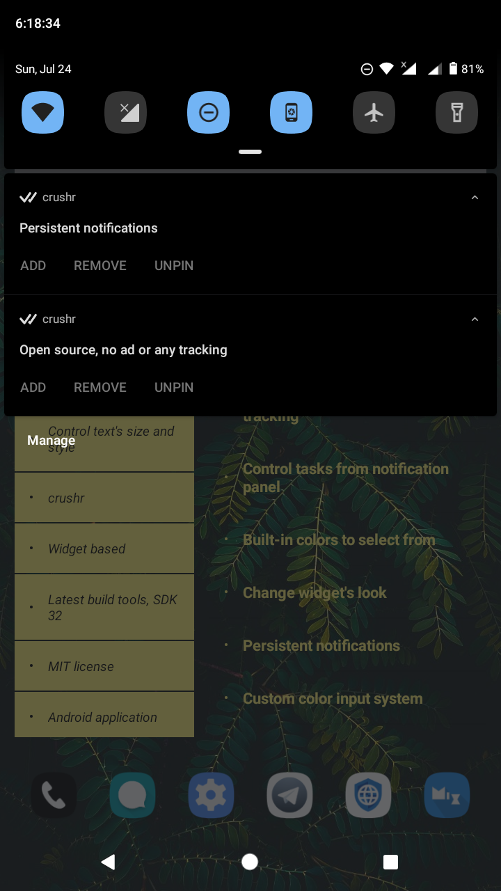
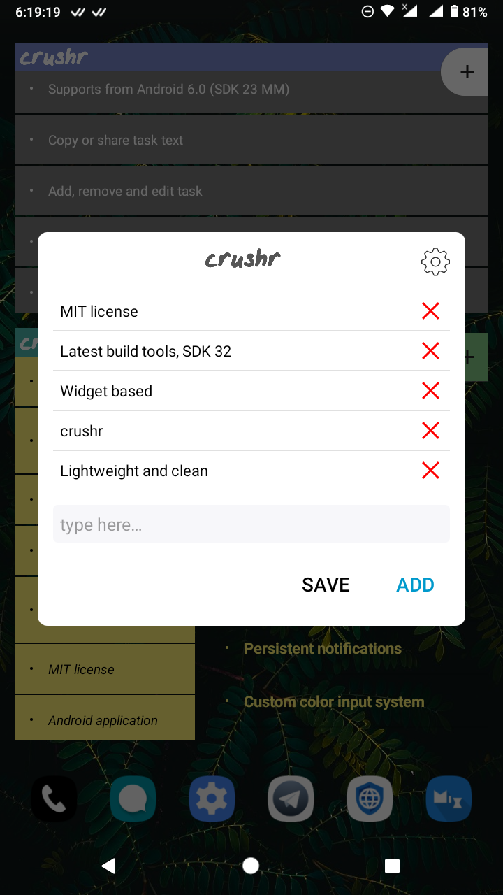
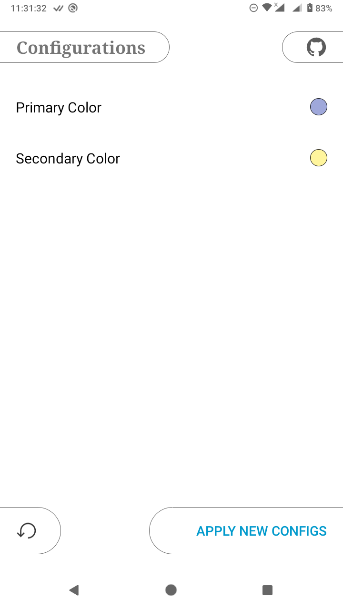
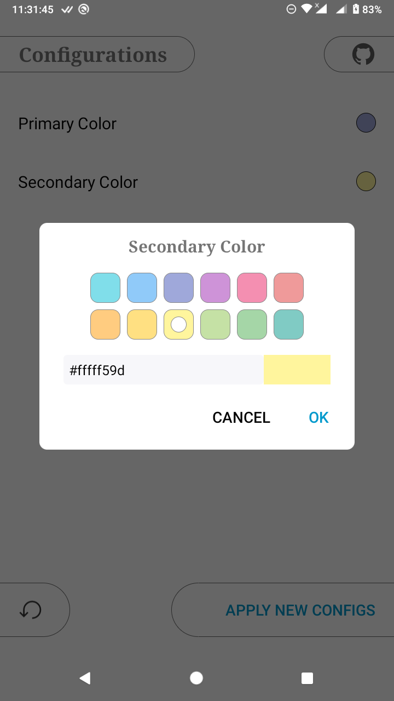

<div align='center'>
	
    <h1 style='color:#ffff9e80;'>crushr</h1>
    <strong>A widget based TODO manager app for android</strong>
	<p>
		
		
		<a href='https://github.com/iamrasel/crushr/blob/master/LICENSE.md'></a>
		<a href='https://github.com/iamrasel/crushr/actions'></a>
        <br>
        
		<a href='https://github.com/iamrasel/crushr/releases'></a>
		
		
	</p>
</div>

## Features
- [x] Supports from Android 6.0 (SDK 23 MM)
- [x] Add, remove and edit task
  - [x] Copy or share task text
  - [x] Quick tweet
- [x] Pin task to notification area
  - [x] Control task from notification panel
- [x] Change primary and secondary color
  - [x] Built-in material colors to select from
  - [x] Custom color input
- [x] Reset configurations
- [ ] See [TODO](#todo) section

## Screenshots
As per version 5 (14072022). Click on the image to enlarge it.

<div align='center'>
	
	
	
	
	
	
</div>

## Download
Currently, you can download the app either from Github releases or from IzzyOnDroid. The Github release version was built using Github's workflow, then I manually published the apk file as a release.

<div align='center'>
	<a href='https://github.com/iamrasel/crushr/releases/latest'></a>
	<a href='https://apt.izzysoft.de/fdroid/index/apk/rasel.neo.crushr'></a>
</div>

You can also download the latest workflow build by Github. To do that, head over to the [Actions](https://github.com/iamrasel/crushr/actions) tab and then select the latest run from there. You must be signed in to Github to download any build from there.

There's another option to get this app- fork and build it. This project is very simple and pure, it doesn't need any additional setup. Just open it in Android Studio.

## TODO
- Known issues:
  - Tasks showing in random order
  - Bugs, those are playing with me
- Features:
  - Show or hide the 'crushr' header
  - Widget's background color changing option
  - Task text's color changing option
  - Task text's size changing option
  - Task text's style changing option
  - Task text's font face changing option
  
## Contributing
If you want to contribute to this project, I would suggest you to start from the [TODO](#todo) list first. Then you can do whatever comes up to your mind.

## Credits
  **Project:** As you can see, this is a fork of [this](https://github.com/tjmolinski/crushr) same titled project, which was abandoned back in 2015. I found this app on [F-droid](https://f-droid.org/en/packages/com.tjm.crushr), used it and then decided to modify it to fulfill my needs. But then I thought, why not share it with others?

 **SVG Icons:** All the svg icons (including launcher icon) were collected from [SVG Repo](https://www.svgrepo.com/). Then I edited some icons according to the needs using [Method Draw Vector Editor](https://editor.method.ac/).

## License
```
	The MIT License (MIT)
	...
	And you know the rest.
```
